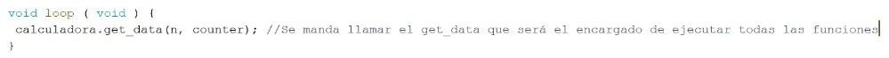

# Práctica 1: Sistemas Embebidos para el Internet de las Cosas.

> Primera Parcial

- FACULTAD DE TELEMATICA
- INGENIERÍA EN SOFTWARE
- “5ºG”
- INTERNET DE LAS COSAS
- ASESOR: M. en C. ESLI CASTELLANOS BERJÁN

> EQUIPO ALFA BUENA MARAVILLA ONDA DINAMITA ESCUADRÓN LOBO OMEGA

- AGUIRRE ROMERO RAMÓN ALEJANDRO
- ARELLANO VELAZCO FERNANDO DE JESÚS
- CARRIZALES GARCÍA ANA JULIA
- GONZALEZ MAGAÑA GAMALIEL ADALID
- MEZA AGUILAR KAROL MARCELINO
- TEJEDA RODRIGUEZ TIRZO NOÉ

## INTRODUCCIÓN

En el transcurso de las clases de Internet of Things, se han desarrollado algunas actividades que usaron la IDE de Arduino y la placa de desarrollo ESP32 con el objetivo de familiarizarse con ellos.
Durante el desarrollo de está práctica se creará un programa que calcule el rango máximo y mínimo de números enteros sin (uint) y con (int) signo según el número de bits que se posea.

## OBJETIVO GENERAL

Conocer y emplear tarjetas de desarrollo embebido para la generación de prototipos para el Internet de las Cosas.

## OBJETIVO ESPECÍFICO

- Identificar información necesaria para la utilización de una tarjeta de desarrollo embebido de uso libre y a elección del equipo, según las necesidades.
- Desarrollar una arquitectura de software simple.

> ENTREGA: VIERNES 30 DE SEPTIEMBRE DEL 2022

## EXPLICACIÓN DEL PROCESO

1. Configurar un baudrate de 115200.

   Es la tasa de transferencia de datos al puerto serial

   

2. Crear una clase llamada “serial_class” mediante un archivo externo con extensión “.h”.

   Se crea un archivo tipo header donde se colocarán todas las funciones separadas por públicas y privadas, dentro del archivo .ino se mandará llamar las funciones públicas y se establecerán variables a utilizar.

   

3. Investigar y comprender el funcionamiento de la función “Serial.available()” y “Serial.read()”.

   El read se utilizó para obtener un dato solamente que en este se especifica que no tome el salto de línea como otro dato. Con el available permite revisar si se ha ingresado un dato o si aún no.

   

4. Crear, integrar un método llamado “get_data”, en el que se obtenga la información del puerto serial mediante el uso de las funciones del punto 7, para enviarlo a los métodos “get_min” y “get_max”.

   Para él la creación de la función get_data se requería que obtuviera información del puerto serial por lo que se utilizó el Serial.read() pero en dado caso de que no se recibiera aún ningún dato entonces imprimiría "INGRESA UN NÚMERO".
   Cuando recibiera un número lo ingresa en una variable para después entrar en un ciclo donde será enviado a la función “post_data”, cuando termine de ejecutar todo lo que debe hacer la función se aumenta el contador en 1 hasta finalizar el ciclo, regresando al archivo P1.ino volverá a ejecutar el ciclo.

   
   

5. Posteriormente crear e integrar un método llamado “get_min” que contenga un algoritmo que calcule el valor mínimo que puede mostrarse con los tipos de variables más comunes (uint8_t, int8_t, uint16_t, int16_t, uint32_t, int32_t, uint64_t, int64_t).

   Para la función “get_min” se requiere crear cuatro variables int8_t, int16_t, int32_t y int64_t dentro de estas se resolverá la ecuación -(2^n-1) donde n es el número recibido de “get_data”. Todas estas variables se ingresarán en un array para posteriormente imprimir la variable que se encuentra en la posición especificada (por el counter) del array.

   

6. Crear e integrar un método llamado “get_max” que contenga un algoritmo que calcule el valor máximo que puede mostrarse con los tipos de variables mostradas en el punto 9.

   Al ejecutar la función “get_max” se tendrá unas condiciones dependiendo del número que se recibió, si se recibe 1 entonces se ejecutará la función “post_maxPos” y en cualquier otro caso se ejecuta la función “post_maxNeg”.
   Para la función get_max se requiere crear ocho variables, 4 de la función “post_maxPos”: int8_t, int16_t, int32_t y int64_t, dentro de estas se resolverá la ecuación (2^n-1)-1 donde n es el número recibido de “get_data”. y 4 de “post_maxNeg”: uint8_t, uint16_t, uint32_t y uint64_t dentro de estas se resolverá la ecuación (2^n)-1 donde n es el número recibido de “get_data”.
   Todas estas variables se ingresarán en un array respectivo a su función para posteriormente imprimir la variable que se encuentra en la posición especificada (por el counter) del array.

   

7. Crear e integrar un método llamado “post_data”, en el que se muestre la información concatenada final mediante el puerto serial.

   Se crea la función “get_infoVar” para dar información al usuario sobre cuántos bits se están utilizando en las variables.
   La función “post_data” se encargará de ejecutar las funciones “get_info”, “get_max'' y “get_min” pero organizará la manera en que se imprimirán los resultados para tener un texto más entendible.

   

## RESULTADOS

Al abrir el puerto serial del COM3 solicitará que se ingrese un número al ingresar el número se ejecutarán unas funciones.

Al ingresar el número se ejecutarán las funciones dándonos como resultado su cálculo pero con variables de 8, 16, 32 y 64 bits en su rango máximo y mínimo en negativo así como positivo.

## OBSERVACIONES Y CONCLUSIONES

- Aguirre Romero Ramón Alejandro:

  Con la elaboración de la práctica he empezado a entender algunos de los fundamentos para la programación en Arduino IDE que se basa en los lenguajes de C y C++. Es interesante conocer que a diferencia de JavaScript donde sin importar cómo crees la variable no tendrá tipo o límite a diferencia de C y C++ pienso que esto se realiza con el objetivo de no consumir mucho espacio en los sistemas embebidos que se programan y utilizar solamente lo que requiere.

- Arellano Velasco Fernando de Jesús:

  Durante la elaboración de la práctica se pudo observar un sistema embebido que fue elaborado con una placa ESP32 de 38 pines y cómo funcionaba al ser programado con la IDE de Arduino. Hoy en día, las nuevas generaciones de placas, como lo es la placa ESP32, hacen posible el desarrollo de dispositivos que utilizan el internet de las cosas ya que presentan módulos que integran el WIFI.
  Para la programación del software, se necesitó tener conocimientos de lenguajes de C y C++ debido a que la IDE de Arduino maneja un lenguaje similar. A la hora de desarrollar el programa, se observó que si no se usa el tipo de dato correcto, este puede no funcionar correctamente o simplemente no compilar.
  Finalmente, el uso de clases creadas por el usuario ayudan a los programadores a conseguir el objetivo esperado con tan solo llamarlas en el archivo principal.

- Carrizales García Ana Julia:

  Al concluir la realización de esta práctica y la elaboración del presente informe, corroboré mis conocimientos acerca de calcular los rangos de un entero con o sin signo de n bits. Todas las instalaciones necesarias para el desarrollo de la práctica fueron importantes y sencillas de lograr. La investigación de muchas instrucciones esenciales fue clave para el correcto funcionamiento del producto final.

- González Magaña Gamaliel Adalid:

  Durante esta práctica aprendí un poco del lenguaje de programación de C++, el cómo funciona y cuales son unos de sus usos. También aprendí sobre el hardware de nuestra placa de desarrollo ESP32, así como sus principales diferencias con otras placas, sus aplicaciones y fortalezas. Una de las fortalezas más destacables del lenguaje es que es muy ligero, y una de las fortalezas de nuestra placa es que es de bajo consumo, por lo que al juntar ambas ventajas se permite tener un sistema muy ligero y que puede funcionar por mucho tiempo.

- Meza Aguilar Karol Marcelino:

  A lo largo de esta práctica pude comprender sobre el lenguaje C++ ya que no lo había usado prácticamente, al igual que nuestra placa ESP32 que a comparación de la que teníamos anteriormente esta posee más ventajas y facilidades que nos ayudaron a desarrollar la práctica sin problemas, en la cual pude utilizar los conocimientos que he adquirido a lo largo de esta parcial sobre Arduino.

- Tejeda Rodríguez Tirzo Noé:

  Durante la realización de la práctica pudimos poner en práctica los conocimientos que hemos adquirido durante la parcial. Aplicamos los aprendizajes de C++, como los tipos de datos, funciones, librerías y cómo adaptar la herramienta de trabajo que es Arduino IDE para que se pueda comunicar correctamente con el sistema embebido que utilizamos, que es el ESP32; cuya información conocimos para saber sus características como la particularidad que tiene de que para subir el código se le tiene que presionar el botón de boot. En sí, el desarrollar la práctica no me parece que fuera complicado, lo complicado fue el aprender un nuevo lenguaje de programación que, a diferencia de JavaScript, sí usa tipos de datos, además de conocer librerías que nos puedan facilitar la realización del programa.

## REFERENCIAS

- Cruz, L. (2009). Control electrónico de válvulas hidráulicas a través de un ordenador. Tesis de licenciatura. Instituto Politécnico Nacional.
- Daniel. A. (2014). Protocolos de comunicación entre microcontroladores. Caso de estudio: Protocolo CAN. Tesis de licenciatura. Universidad Nacional de la Plata.
- Evans, W. (2007). Arduino Notebook: A Beginner’s Reference Written. Stanford.
- Espressif. (2022). ESP32 Series Datasheet. Espressif Systems. https://www.espressif.com/sites/default/files/documentation/esp32_datasheet_en.pdf
- Instituto Tecnológico de Sonora. (2011). Lenguajes de interfaz (documento interno). México. https://pdfcoffee.com/unidad-iv-lenguajes-de-interfaz-2-pdf-free.html
- López, E. (1997). Sobre voltajes, causas y medidas de protección. Tesis de maestría. Universidad Nacional Autónoma de Nuevo León. http://eprints.uanl.mx/502/1/1020123001.PDF
- TARA Systems GmbH. (2022). Data types: int8, int16, int32, int64. Embedded Wizard. https://doc.embedded-wizard.de/int-type?v=11.00
- TARA Systems GmbH. (2022). Data types: uint8, uint16, uint32, uint64. Embedded Wizard. https://doc.embedded-wizard.de/uint-type?v=11.00
- Universidad Militar Nueva Granada. (2022). Parámetros para establecer un canal de comunicación para el protocolo RS232. UMNG. http://virtual.umng.edu.co/distancia/ecosistema/ovas/ingenieria_informatica/circuitos_electricos_y_microcontroladores/unidad_3/medios/interactividades/pat3_1/pat3_1.html
